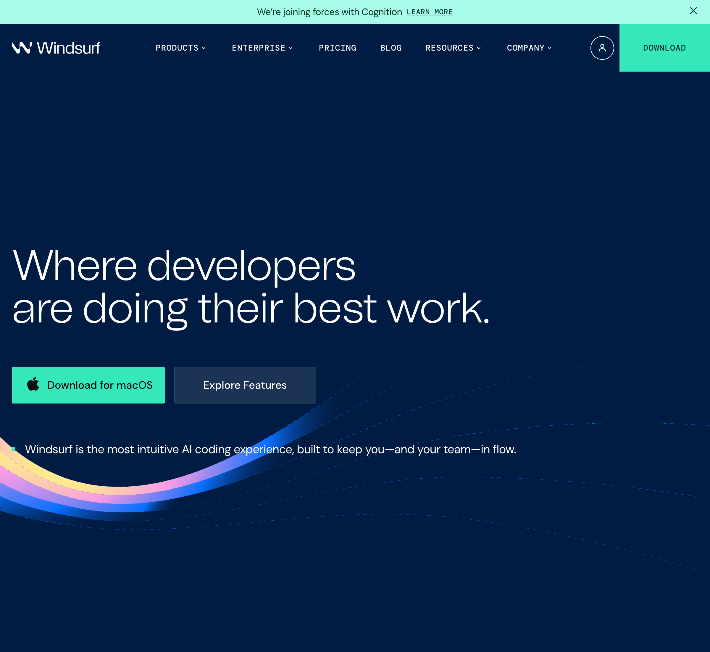

# Windsurf インストール手順

**対象**: Windows / Mac  
**バージョン**: Windsurf IDE（最新版）  
**所要時間**: 約10分

---

## 📋 事前確認

### システム要件

- **Windows**: Windows 10以上（x64またはarm64）
- **Mac**: macOS 10.15以上（IntelチップまたはApple Silicon（M1/M2））
- **インターネット接続**: 必須（インストール・初期設定時に必要）

### 必要なアカウント

- **GitHubアカウント** または **Googleアカウント**（サインイン時に使用）

---

## 🚀 インストール手順

### Step 1: 公式サイトからダウンロード

1. ブラウザで [Windsurf公式サイト](https://windsurf.com/) を開く

   
   *Windsurf公式サイトのトップページ。画面中央に「Download for macOS」ボタンと「Explore Features」ボタンが表示されます。*

2. 画面中央の **「Download」** ボタンをクリック
   - 自動的にOSに応じたファイルがダウンロードされます
   - Windows: `WindsurfUserSetup-x64.exe` または `WindsurfUserSetup-arm64.exe`
   - Mac: `Windsurf-darwin-x64.dmg` または `Windsurf-darwin-arm64.dmg`

#### Macの場合：チップの確認方法

Macのチップを確認する方法：
1. 画面左上の **「Appleメニュー」** をクリック
2. **「このMacについて」** を選択
3. **「チップ」** の欄を確認
   - **Apple Silicon** と表示 → arm64版をダウンロード
   - **Intel** と表示 → x64版をダウンロード

### Step 2: インストール実行

#### Windows の場合

1. ダウンロードした `.exe` ファイルをダブルクリック
2. セキュリティ警告が表示された場合は **「詳細情報」→「実行」** をクリック
3. インストールウィザードが起動します
4. **「Next」** をクリックして進める
5. インストール先はデフォルトのままでOK
6. **「Install」** をクリック
7. インストール完了後、**「Finish」** をクリック
8. Windsurfが自動的に起動します

#### Mac の場合

1. ダウンロードした `.dmg` ファイルをダブルクリック

2. 開いたウィンドウで **「Windsurf」** アイコンを **「Applications」** フォルダにドラッグ&ドロップ

   > 💡 **ヒント**: DMGファイルを開くと、左側にWindsurfアイコン、右側にApplicationsフォルダが表示されます。WindsurfアイコンをApplicationsフォルダにドラッグ&ドロップします。

3. ApplicationsフォルダにWindsurfがコピーされます

4. 初回起動時、セキュリティ警告が表示される場合があります
   - **「システム環境設定」→「セキュリティとプライバシー」→「このまま開く」** をクリック

5. ApplicationsフォルダからWindsurfを起動

### Step 3: 初回起動とサインイン

1. Windsurfを起動します
2. 初回起動時、セットアップウィザードが表示されます
3. **「Get Started」** をクリック
4. サインイン画面が表示されます
5. **「Sign in with GitHub」** または **「Sign in with Google」** を選択
6. ブラウザが開くので、アカウント情報を入力してログイン
7. 認証が完了すると、Windsurfが起動します

---

## ⚙️ 初期設定

### 1. カラーテーマの選択

初回起動時にカラーテーマの選択画面が表示されます：
- **Light**（ライト）
- **Dark**（ダーク）
- **System**（システム設定に従う）

お好みのテーマを選択してください。後から変更も可能です。

### 2. 日本語化（推奨）

1. 左側のサイドバーから **「Extensions」**（拡張機能）アイコンをクリック
   - または `Cmd+Shift+X`（Mac）/ `Ctrl+Shift+X`（Windows）で開く
2. 検索バーに **「Japanese Language Pack」** と入力
3. **「Japanese Language Pack for Visual Studio Code」** を選択
4. **「Install」** をクリック
5. インストール後、**「Restart」** をクリックしてWindsurfを再起動
6. 再起動後、日本語化が反映されます

### 3. AIモデルの設定

1. 画面右下の歯車アイコン（⚙️）をクリック
2. **「Settings」** を選択
3. 左側メニューから **「Windsurf」** または **「AI」** を選択
4. **「Model」** で使用するAIモデルを選択
   - 無償枠の場合: **「Claude Sonnet 4.5」** または **「GPT-4o」** が利用可能
5. 設定は自動保存されます

### 4. Cascade AIの確認

Windsurfの特徴的な機能「Cascade AI」が利用可能か確認します：
1. 画面下部の **「Cascade」** ボタンをクリック
2. AIチャットが開くことを確認
3. プロンプトを入力して応答があることを確認

---

## 🔧 トラブルシューティング

### インストールが失敗する場合

**Windows:**
- 管理者権限で実行してみる
- ウイルス対策ソフトがブロックしていないか確認
- 一時的にウイルス対策ソフトを無効化して再試行
- x64版とarm64版を間違えていないか確認

**Mac:**
- セキュリティ設定で許可する
  - **「システム環境設定」→「セキュリティとプライバシー」→「このまま開く」**
- Gatekeeperの警告が出た場合も同様に対応
- Intel版とApple Silicon版を間違えていないか確認

### 起動しない場合

1. Windsurfを完全に終了（プロセスを確認）
2. 再起動を試す
3. それでも起動しない場合、再インストールを試す

### サインインできない場合

1. ブラウザでGitHub/Googleにログインできるか確認
2. ファイアウォールやプロキシ設定を確認
3. 別のアカウントで試す

### Cascade AIが動作しない場合

1. **「Settings」→「Windsurf」** でAIモデル設定を確認
2. インターネット接続を確認
3. 無償枠を使い切っていないか確認
4. Windsurfを再起動してみる

### 日本語化が反映されない場合

1. Windsurfを完全に再起動する
2. 拡張機能が正しくインストールされているか確認
3. **「Settings」→「Language」** で言語設定を確認

---

## 📚 参考資料

### 公式サイト

- **Windsurf公式サイト**: https://www.windsurf.dev/
- **Windsurf公式ドキュメント**: https://docs.windsurf.dev/
- **GitHubリポジトリ**: https://github.com/windsurf-dev/windsurf

### 詳細なインストール手順（画像付き）

以下のサイトには、スクリーンショット付きの詳細な手順が掲載されています。より詳しい手順が必要な場合は、こちらも参考にしてください。

1. **リツト氏のnote記事（Windows版）**
   - URL: https://note.com/ritsuto2525/n/n4639c549e2fa
   - 特徴: 完全日本語対応、画面キャプチャが各ステップに配置、超初心者向けの丁寧な解説、日本語化手順も含む
   - 更新日: 2025年7月～8月

2. **リツト氏のnote記事（Mac版）**
   - URL: https://note.com/ritsuto2525/n/n0f87f6d10f0c
   - 特徴: Mac専用の詳細手順、Intel/Apple Silicon（M1/M2）の判別方法、Finder連携の豆知識も掲載
   - 更新日: 2025年7月～8月

3. **ユキト氏のCodeVibesブログ**
   - URL: https://yukitoblog.fun/home/windsurf-install/
   - 特徴: 概念説明が超丁寧、大量のスクリーンショット、使用許諾契約書の日本語訳付き、実際の作成デモあり
   - 更新日: 2025年6月

---

## 💡 次のステップ

インストールが完了したら、以下を確認してください：

1. ✅ Windsurfが正常に起動する
2. ✅ サインインが完了している
3. ✅ 日本語化が完了している（推奨）
4. ✅ Cascade AIが動作する

**準備完了です！ハンズオンを楽しんでください！** 🎉

---

## 🔄 Cursorからの切り替え方法

Cursorの無償枠を使い切った場合、Windsurfへの切り替えが簡単です：

1. Windsurfをインストール（上記手順参照）
2. 同じGitHub/Googleアカウントでサインイン
3. プロジェクトフォルダを開く
4. すぐに開発を再開できます

**Windsurfも無償枠が充実しているので、安心して利用できます！**

---

**最終更新日**: 2025年11月13日  
**作成者**: 甲斐

