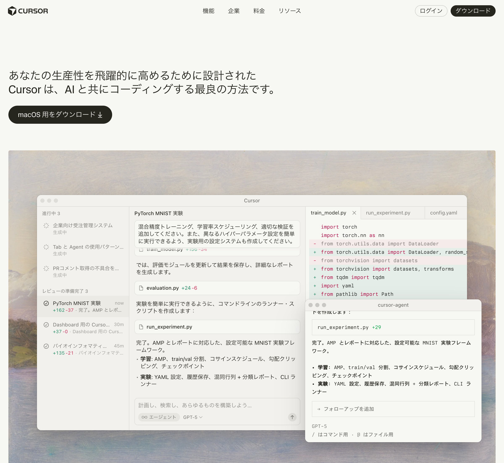
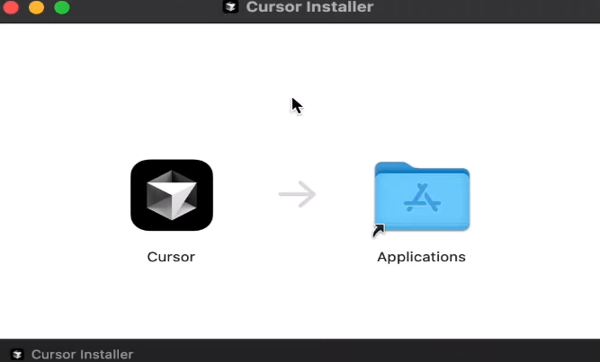
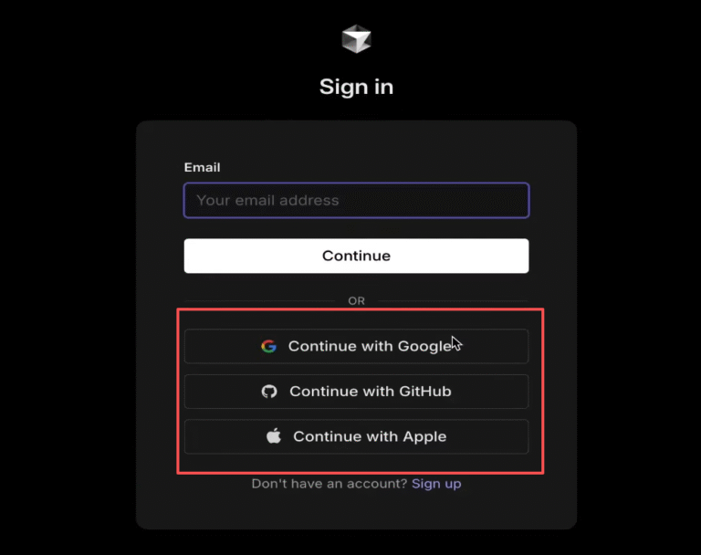

# Cursor 2.0 インストール手順

**対象**: Windows / Mac  
**バージョン**: Cursor 2.0（最新版）  
**所要時間**: 約10分

---

## 📋 事前確認

### システム要件

#### macOS要件

- **OS**: macOS 12 Monterey以上推奨（Sonoma/Venturaが理想的）
- **RAM**: 8GB最小、16GB推奨（大きなリポジトリや複数のAIチャットを同時に使用する場合）
- **ストレージ**: 約1-2GBの空き容量（インストーラーは約200-300MB、プロジェクトとキャッシュで追加容量が必要）
- **チップ**: Apple Silicon（M1/M2/M3）またはIntelチップ対応

#### Windows要件

- **OS**: Windows 10（64-bit）またはWindows 11
- **RAM**: 8GB最小、16GB推奨（マルチリポジトリ＋AI使用時）
- **ストレージ**: 約1-2GBの空き容量

#### 推奨ハードウェア

- **RAM**: 16GBが最適（AIコード補完、マルチファイル編集、ローカルDocker実行時）
- **ストレージ**: 高速SSD（リポジトリのインデックス作成速度に影響）
- **CPU**: MacではApple Silicon、Windowsでは最近のi5/Ryzen 5以上が快適

### 必要なアカウント

- **GitHubアカウント** または **Googleアカウント**（サインイン時に使用）
- **インターネット接続**: 必須（インストール・初期設定・AI機能使用時に必要）

---

## 🚀 インストール手順

### Step 1: 公式サイトからダウンロード

> ⚠️ **重要**: 必ず[公式サイト](https://cursor.com/)からダウンロードしてください。サードパーティのフォーラムなどからのダウンロードは避けてください。

1. ブラウザで [Cursor公式サイト](https://cursor.com/) を開く

   
   *Cursor公式サイトのトップページ。画面中央に「ダウンロード」ボタンが表示されます。*

2. 画面右上の **「ダウンロード」** ボタンをクリック、または [ダウンロードページ](https://cursor.com/download) に直接アクセス

3. ダウンロードページで、**「Cursor をダウンロード」** セクションの **「macOS 用をダウンロード」** または **「Windows 用をダウンロード」** ボタンをクリック

   
   *ダウンロードページの上部に表示される「Cursor をダウンロード」セクション。お使いのOSに応じたボタンをクリックしてください。*

4. ダウンロードサイズと所要時間
   - **インストーラーサイズ**: 約200-300MB
   - **ダウンロード時間**: 高速Wi-Fiで1分未満、低速接続で3-7分程度
   - **注意**: インストール後、Cursorは更新やモデルアセットを取得する場合があります。同期が完了するまで待ってからパフォーマンスを判断してください。

### Step 2: インストール実行

#### Windows の場合

1. ダウンロードした `.exe` ファイルをダブルクリック

2. Microsoft Defender SmartScreenの警告が表示される場合があります
   - これは初回実行時の信頼性チェックです
   - **「詳細情報」→「実行」** をクリックして続行
   - 発行元を確認してから実行してください

3. インストールウィザードが起動します

4. **「Next」** をクリックして進める
   - インストール先はデフォルトのままでOK（別のドライブを選択することも可能）

5. **「Install」** をクリック

6. インストール完了後、**「Launch Cursor」** にチェックを入れて **「Finish」** をクリック
   - または、スタートメニューからCursorを起動

#### Mac の場合

1. ダウンロードした `.dmg` ファイルをダブルクリック

2. 開いたウィンドウで **「Cursor」** アイコンを **「Applications」** フォルダにドラッグ&ドロップ

   
   *DMGファイルを開くと、左側にCursorアイコン、右側にApplicationsフォルダが表示されます。CursorアイコンをApplicationsフォルダにドラッグ&ドロップします。*

3. ApplicationsフォルダにCursorがコピーされます
   - **重要**: DMGファイルから直接実行せず、必ずApplicationsフォルダにコピーしてください

4. 初回起動時、Gatekeeperの警告が表示される場合があります
   - これは正常な動作です（ダウンロードしたアプリの初回起動時によくある警告）
   - **「システム環境設定」→「プライバシーとセキュリティ」→「このまま開く」** をクリック
   - または、Applicationsフォルダから直接起動して警告を確認

### Step 3: 初回起動とサインイン

1. Cursorを起動します

2. 初回起動時、サインイン画面が表示されます

   

     
     
   

   *初回起動時に表示されるサインイン画面。「Sign in with GitHub」または「Sign in with Google」を選択します。*

3. **「Sign in with GitHub」** または **「Sign in with Google」** を選択

4. ブラウザが開くので、アカウント情報を入力してログイン

5. 認証が完了すると、Cursorが起動します

---

## ⚙️ 初期設定

### 1. 日本語化（推奨）

1. 左側のサイドバーから **「Extensions」**（拡張機能）アイコンをクリック
   - または `Cmd+Shift+X`（Mac）/ `Ctrl+Shift+X`（Windows）で開く

2. 検索バーに **「Japanese Language Pack」** と入力

3. **「Japanese Language Pack for Visual Studio Code」** を選択

   > 💡 **ヒント**: 検索結果の一番上に「Japanese Language Pack for Visual Studio Code」が表示されます。Microsoftが提供している拡張機能です。

4. **「Install」** をクリック

5. インストール後、**「Restart」** または **「Change Language and Restart」** をクリックしてCursorを再起動

6. 再起動後、日本語化が反映されます

### 2. AIモデルの設定

Cursor 2.0には、組み込みのAIモデルが含まれています。

1. 画面右下の歯車アイコン（⚙️）をクリック
2. **「Settings」** を選択
3. 左側メニューから **「Cursor」** を選択
4. **「Model」** で使用するAIモデルを選択
   - Cursor 2.0には組み込みのAIモデルが含まれています
   - 無償枠では使用制限があります
   - より高度な機能や使用量が必要な場合は、有料プランへのアップグレードを検討してください
5. 設定は自動保存されます

### 3. Privacy Modeの設定（重要）

1. **「Settings」→「Cursor」** を開く
2. **「Privacy Mode」** の設定を確認
   - **「Send code to AI」**: 有効（AIにコードを送信する）
   - **「Send telemetry」**: 任意（使用状況の送信）

### 4. Auto Saveの設定（推奨）

1. **「Settings」→「Files」** を開く
2. **「Auto Save」** を **「afterDelay」** に設定
   - これにより、編集中のファイルが自動保存されます

---

## 🔧 トラブルシューティング

### インストールが失敗する場合

**共通の対処法:**
- [公式サイト](https://cursor.com/)から再ダウンロード（ファイルが破損している可能性）
- インストール中にアンチウイルスソフトを一時的に無効化してから再試行

**Windows:**
- 管理者権限で実行してみる
- Microsoft Defender SmartScreenの警告が出た場合
  - 発行元を確認し、**「詳細情報」→「実行」** をクリック
  - 企業デバイスの場合、IT部門にCursorまたはそのアップデーターのホワイトリスト登録を依頼する必要がある場合があります

**Mac:**
- Gatekeeperの警告が出た場合
  - **「システム環境設定」→「プライバシーとセキュリティ」→「このまま開く」** をクリック
  - [Appleの公式手順](https://support.apple.com/guide/mac-help/open-a-mac-app-from-an-unidentified-developer-mh40616/mac)も参照してください
- Applicationsフォルダに正しくコピーされているか確認（DMGから直接実行していないか）

### 起動しない場合

1. Cursorを完全に終了（プロセスを確認）
2. キャッシュをクリアして再起動
   - **macOS**: `~/Library/Application Support/Cursor` を削除（バックアップを取ってから）
   - **Windows**: `%AppData%\Cursor` を確認
   - その後、Cursorを再起動してサインインし直す
3. 特定の拡張機能が原因の場合
   - 拡張機能を無効化して起動を試す
   - 問題が解決したら、拡張機能を1つずつ再有効化して原因を特定
4. それでも起動しない場合、最新版を再インストール

### サインインできない場合

1. ネットワーク/プロキシ設定を確認
   - 企業プロキシが認証をブロックしている可能性があります
2. 別のネットワークで試す（モバイルホットスポットなど）
   - ファイアウォールルールを除外するため
3. SSO（シングルサインオン）がループする場合
   - 一時的にメール/パスワードでログインを試す
   - 問題が続く場合はサポートに連絡
4. ブラウザでGitHub/Googleにログインできるか確認

### AIが応答しない場合

1. **「Settings」→「Cursor」** でモデル設定を確認
2. インターネット接続を確認
3. 無償枠を使い切っていないか確認
   - 無償枠を使い切った場合、Windsurfへの切り替えを検討

### 企業環境での注意事項

- 企業のラップトップでテストする場合、承認されたモデルプロバイダーについて事前に確認してください
- 企業プロキシやファイアウォールがCursorの通信をブロックしている可能性があります
- IT部門にCursorまたはそのアップデーターのホワイトリスト登録を依頼する必要がある場合があります

---

## 📚 参考資料

### 公式サイト

- **Cursor公式サイト**: https://cursor.com/
- **Cursor公式ドキュメント**: https://cursor.com/docs
- **Cursor Changelog**: https://cursor.com/changelog
- **Anthropic API ドキュメント**: https://docs.anthropic.com/

### 詳細なインストール手順（画像付き）

以下のサイトには、スクリーンショット付きの詳細な手順が掲載されています。より詳しい手順が必要な場合は、こちらも参考にしてください。

1. **Skywork AI - How to Download and Install Cursor 2.0**
   - URL: https://skywork.ai/blog/vibecoding/how-to-download-and-install-cursor-2-0-on-macos-windows/
   - 特徴: Cursor 2.0専用の詳細ガイド、macOS/Windows/Linux対応、システム要件からトラブルシューティングまで網羅、実体験に基づく解説
   - 更新日: 2025年10月31日

2. **Tech Creator Hub - Cursor完全ガイド**
   - URL: https://tech-creator-hub.hatenablog.com/entry/cursor-complete-guide-settings-2025/
   - 特徴: Cursor 2.0対応、Windows/Mac/Linux全OS対応、スクリーンショット付き、日本語化まで完全網羅
   - 更新日: 2025年11月7日

3. **note - 非エンジニア向けCursor AI入門**
   - URL: https://note.com/curiosity_com/n/n4b1ad523c143
   - 特徴: 非エンジニア向けのやさしい解説、動画連動型、英語画面もフォロー
   - 更新日: 2025年10月23日

---

## 💡 次のステップ

インストールが完了したら、以下を確認してください：

1. ✅ Cursorが正常に起動する
2. ✅ サインインが完了している
3. ✅ 日本語化が完了している（推奨）
4. ✅ AIチャットが動作する

**準備完了です！ハンズオンを楽しんでください！** 🎉

---

**最終更新日**: 2025年11月13日  
**作成者**: 甲斐  
**ベース**: [Skywork AI - How to Download and Install Cursor 2.0](https://skywork.ai/blog/vibecoding/how-to-download-and-install-cursor-2-0-on-macos-windows/)
